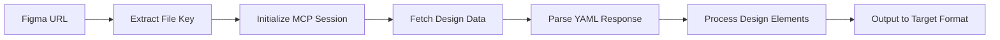

# 📋 Recommendations for Figma-Context-MCP README

Based on our successful integration experience, here are key recommendations to improve the Figma-Context-MCP README and make it more developer-friendly.

## 🎯 **Missing Critical Information**

### **1. Correct Accept Headers (CRITICAL)**
The current README doesn't mention the **most important requirement**:

```javascript
// REQUIRED: Both content types must be included
headers: {
  'Content-Type': 'application/json',
  'Accept': 'application/json, text/event-stream' // This is critical!
}
```

**Recommendation**: Add a prominent "Critical Requirements" section at the top.

### **2. SSE Response Format Documentation**
The README doesn't explain that responses come in Server-Sent Events format:

```
event: message
data: {"result":{"content":[{"type":"text","text":"YAML_CONTENT_HERE"}]},"jsonrpc":"2.0","id":2}
```

**Recommendation**: Add a "Response Format" section with parsing examples.

### **3. Session Management Details**
Missing information about session lifecycle:

```javascript
// Step 1: Initialize to get session ID
const initResponse = await fetch('/mcp', { /* init payload */ });
const sessionId = initResponse.headers.get('mcp-session-id');

// Step 2: Use session ID in subsequent requests
const dataResponse = await fetch('/mcp', {
  headers: { 'mcp-session-id': sessionId }
});
```

**Recommendation**: Add detailed session management examples.

---

## 🔧 **Technical Improvements Needed**

### **1. Working Code Examples**
Current examples are incomplete. Add full working examples:

```javascript
// COMPLETE WORKING EXAMPLE
import fetch from 'node-fetch';

async function fetchFigmaData(fileKey, nodeId) {
  // Initialize session
  const initResponse = await fetch('https://figma-context-mcp-fre3.onrender.com/mcp', {
    method: 'POST',
    headers: {
      'Content-Type': 'application/json',
      'Accept': 'application/json, text/event-stream', // CRITICAL!
    },
    body: JSON.stringify({
      jsonrpc: '2.0',
      method: 'initialize',
      params: {
        protocolVersion: '2024-11-05',
        capabilities: {},
        clientInfo: { name: 'test-client', version: '1.0.0' },
      },
      id: 1,
    }),
  });

  const sessionId = initResponse.headers.get('mcp-session-id');

  // Fetch data
  const dataResponse = await fetch('https://figma-context-mcp-fre3.onrender.com/mcp', {
    method: 'POST',
    headers: {
      'Content-Type': 'application/json',
      'Accept': 'application/json, text/event-stream',
      'mcp-session-id': sessionId,
    },
    body: JSON.stringify({
      jsonrpc: '2.0',
      method: 'tools/call',
      params: {
        name: 'get_figma_data',
        arguments: { fileKey, nodeId },
      },
      id: 2,
    }),
  });

  // Parse SSE response
  const responseText = await dataResponse.text();
  const dataLine = responseText.split('\n').find(line => line.startsWith('data: '));
  const jsonData = JSON.parse(dataLine.substring(6));
  
  return jsonData.result.content[0].text; // YAML content
}
```

### **2. Error Handling Documentation**
Add common errors and solutions:

```markdown
## 🐛 Common Issues

### 406 Not Acceptable
**Cause**: Missing `text/event-stream` in Accept header
**Solution**: Use `Accept: application/json, text/event-stream`

### Session ID Missing
**Cause**: Incorrect initialization
**Solution**: Check MCP protocol version `2024-11-05`

### Parse Errors
**Cause**: Expecting JSON instead of SSE
**Solution**: Parse SSE format with `data: ` prefix
```

### **3. Response Data Structure**
Document the YAML structure returned:

```yaml
metadata:
  name: Design Name
  lastModified: '2025-05-27T08:21:03Z'
  thumbnailUrl: https://...

nodes:
  node_id_123:
    type: FRAME
    name: Component Name
    # ... properties

styles:
  fill_ABC123:
    - '#FF0000'
  layout_XYZ789:
    mode: row
    alignItems: center
```

---

## 📊 **Performance & Deployment Info**

### **1. Cold Start Documentation**
Add information about deployment performance:

```markdown
## ⚡ Performance Notes

- **Cold Start**: 30-90 seconds on first request
- **Warm Requests**: 2-5 seconds response time
- **Session Timeout**: Sessions expire after inactivity
- **Rate Limits**: [Document any limits]
```

### **2. Health Check Usage**
Expand health check documentation:

```markdown
## 🏥 Health Monitoring

### Health Check
```bash
curl https://figma-context-mcp-fre3.onrender.com/health
# Returns: {"status":"healthy","timestamp":"...","version":"0.3.1"}
```

### Debug Endpoint
```bash
curl https://figma-context-mcp-fre3.onrender.com/api/debug-figma
# Returns: API key status and connectivity info
```

### Status Endpoint
```bash
curl https://figma-context-mcp-fre3.onrender.com/api/status
# Returns: {"status":"running","mode":"http","version":"0.3.1"}
```
```

---

## 🎯 **Integration Examples**

### **1. Add Real Integration Examples**
Show how other projects can integrate:

```markdown
## 🔗 Integration Examples

### Figma-to-Elementor Integration
See [figma-to-elementor-mcp](https://github.com/user/figma-to-elementor-mcp) for a complete integration example.

### ChatGPT App Integration
```javascript
// Example ChatGPT app integration
const figmaData = await fetchFromFigmaMCP(fileKey, nodeId);
const elementorCode = await processWithChatGPT(figmaData);
await deployToElementor(elementorCode);
```

### Custom MCP Client
```javascript
// Custom client implementation
class FigmaMCPClient {
  async initialize() { /* session setup */ }
  async fetchDesign(fileKey, nodeId) { /* data fetch */ }
  async close() { /* cleanup */ }
}
```
```

### **2. Add Workflow Diagrams**
```markdown
## 🔄 Workflow


```

---

## 📚 **Documentation Structure Improvements**

### **1. Reorganize Sections**
```markdown
# Figma-Context-MCP

## 🚨 Critical Requirements (NEW)
- Accept headers
- Session management
- Response format

## 🚀 Quick Start (IMPROVED)
- Working examples
- Common use cases

## 📖 API Reference (NEW)
- Endpoints
- Request/response formats
- Error codes

## 🔧 Integration Guide (NEW)
- Step-by-step integration
- Real examples
- Best practices

## 🐛 Troubleshooting (NEW)
- Common issues
- Debug tools
- Performance tips
```

### **2. Add Testing Section**
```markdown
## 🧪 Testing

### Quick Test
```bash
curl -X POST https://figma-context-mcp-fre3.onrender.com/mcp \
  -H "Content-Type: application/json" \
  -H "Accept: application/json, text/event-stream" \
  -d '{"jsonrpc":"2.0","method":"initialize","params":{"protocolVersion":"2024-11-05","capabilities":{},"clientInfo":{"name":"test","version":"1.0.0"}},"id":1}'
```

### Integration Test
```javascript
// Complete integration test
const result = await testFigmaIntegration('z8nv6p3cbJCgTp7hbHXGil', '645:176384');
console.log('Success:', result.success);
```
```

---

## 🎯 **Priority Recommendations**

### **High Priority (Fix Immediately)**
1. ✅ Add correct Accept headers requirement
2. ✅ Document SSE response format
3. ✅ Add working code examples
4. ✅ Document session management

### **Medium Priority (Next Update)**
1. 📊 Add performance documentation
2. 🐛 Add troubleshooting section
3. 🔗 Add integration examples
4. 📚 Reorganize documentation structure

### **Low Priority (Future Enhancement)**
1. 📈 Add monitoring/analytics info
2. 🔒 Add security best practices
3. 🌐 Add multi-language examples
4. 📱 Add mobile/responsive considerations

---

## 💡 **Additional Suggestions**

### **1. Add Success Stories**
```markdown
## 🏆 Success Stories

- **Figma-to-Elementor**: Successfully converts designs to WordPress widgets
- **Design System Sync**: Automated design token extraction
- **Prototyping Tools**: Real-time design-to-code workflows
```

### **2. Add Community Section**
```markdown
## 🤝 Community

- **Discord**: [Link to Discord server]
- **GitHub Discussions**: [Link to discussions]
- **Examples Repository**: [Link to examples]
```

### **3. Add Changelog**
```markdown
## 📝 Changelog

### v0.3.1 (Current)
- ✅ Production deployment on Render.com
- ✅ SSE support with session management
- ✅ Health check endpoints

### v0.3.0
- ✅ HTTP transport support
- ✅ CORS configuration
```

These improvements would make the Figma-Context-MCP much more accessible and reduce integration friction for developers. 